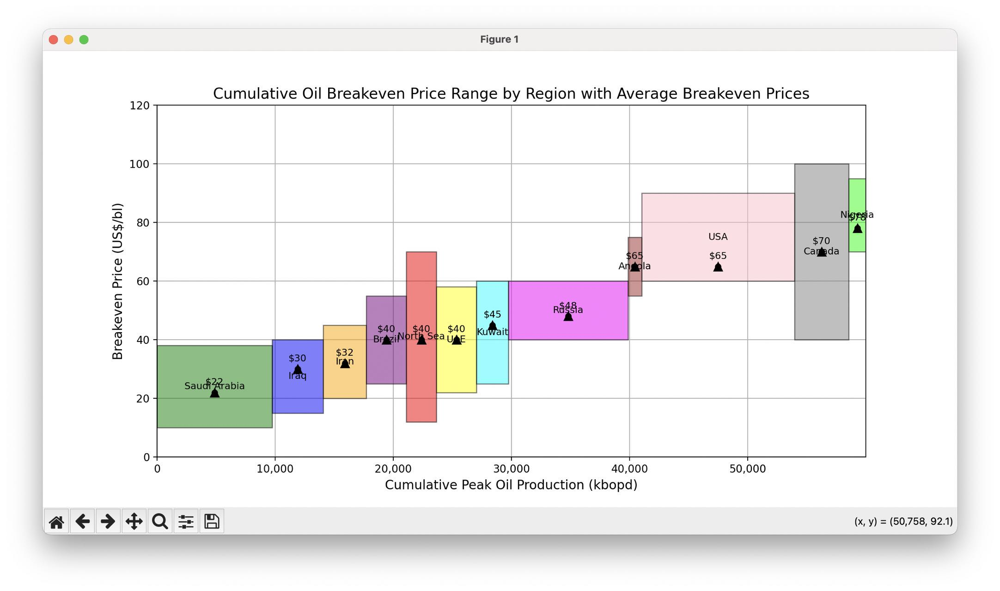
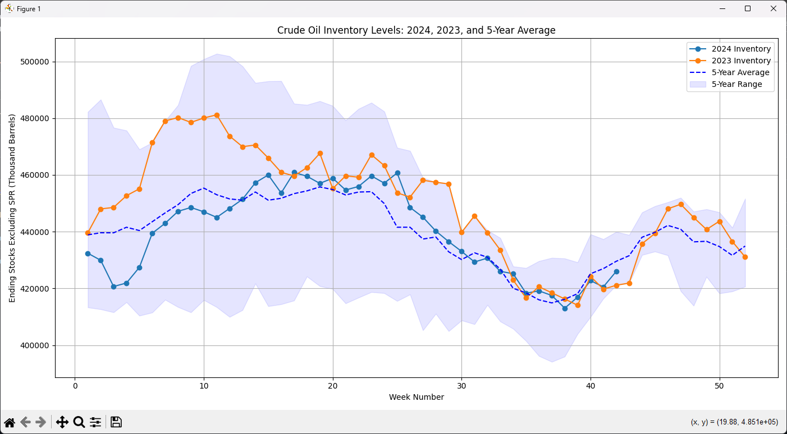
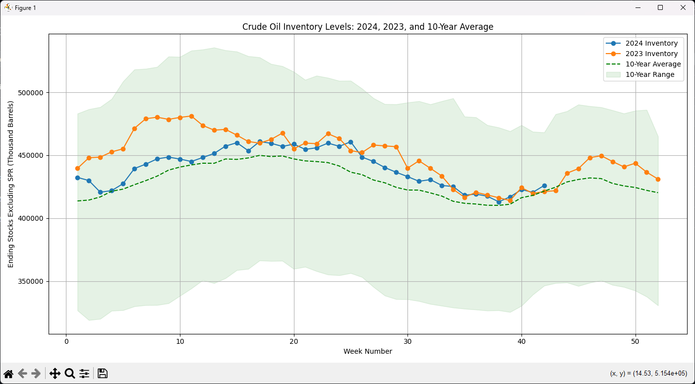

# Crude Futures Sim Trading

Welcome to the Crude Oil Simulation Trading Project! This project leverages historical crude oil data to simulate trading strategies based on price movements, inventory levels, and Commitment of Traders (COT) reports. By integrating multiple data sources and applying a scoring system, this simulation aims to provide insights into potential trading opportunities and market sentiment.

## 📈 Project Overview
The Crude Oil Simulation Trading Project is designed to implement a discretionary trading strategy based on quantitative analysis on the crude oil futures market. By processing and merging data from various sources, the project assigns scores to each trading week, enabling the identification of bullish or bearish market conditions. This comprehensive analysis facilitates informed decision-making for simulated trading scenarios.

## 🧠 Trading Strategy Used
### Objective: 
Trade WTI Crude Oil Futures directionally with a 1-month (30 days) timeframe. 

### Key Components: 
1. Cost Curve (Price Support): 
- Utilize price support levels from the cost curve to identify optimal entry and exit points, ensuring trades are placed at strategic price levels. 

2. Inventory Levels: 
- Monitor weekly inventory data to assess supply and demand dynamics, using changes in inventory to anticipate potential price movements. 

3. CTA Positioning: 
- Analyze Commitment of Traders (COT) data to approximate the positioning of Commodity Trading Advisors (CTAs) or non-commercial traders, gauging market sentiment and crowd behavior to inform trading decisions. 

4. Geo-Political Events: 
- Incorporate recent news and geopolitical developments to contextualize market conditions, enhancing the decision-making process by accounting for external factors that may influence crude oil prices. 

## 📊Visualizations
### Crude Cost Curve
- Price floor/breakeven prices for crude production at different oil producing regions of the world. 
- Analysis based on data released by the EIA and Goldman Top Projects 2023: Back to growth. 

### Inventory Levels Trailing 5/10 Years
- Comprehensive Analysis: Evaluates weekly U.S. crude oil reserves data published by the Energy Information Administration (EIA). 
- Demand Indicators: Lower inventory levels signify inventory draws, reflecting increased demand. 
- Seasonality Insights: Utilizes 5-year and 10-year averages to identify seasonal patterns in inventory levels. 
- Trend Visualization: The sinusoidal patterns observed in seasonality highlight consistent inventory reductions during summer and winter months, corresponding to heightened travel and heating demands, respectively. 

## 🛠️ Features
- Data Integration: Combines Price, Inventory, and COT data based on Year and Week_Number. 
- Scoring System: Assigns scores to each week based on price thresholds, inventory changes, and trader sentiment. 
- Total Score Calculation: Aggregates individual scores to provide an overall market sentiment indicator. 
- Data Filtering: Extracts specific rows based on total score values for targeted analysis. 
- Visualization: (Optional) Visualizes price movements and scores over time. 
- Automated Processing: Streamlines data cleaning, processing, and merging through modular Python scripts. 

## 📚 Data Sources
### Price Data (Price.csv) 
- Description: Contains weekly closing prices and related metrics for crude oil. 
- Key Columns: Year, Week_Number, Close, Open, High, Low, Bid, Ask, Exchange Date, Price Score, various weekly return columns. 

### Inventory Data (Inventory.csv) 
- Description: Represents weekly inventory levels excluding Strategic Petroleum Reserve (SPR) stocks. 
- Key Columns: Year, Week_Number, Absolute Storage Score, Delta Inventory Score. 

### Commitment of Traders (COT) Data (COT.csv) 
- Description: Provides weekly COT reports indicating trader positions. 
- Key Columns: Year, Week_Number, Bullish_Bearish_Score, Delta_Score. 

## 🧰 Technologies Used
### Programming Language: Python 
### Libraries: 
- pandas: Data manipulation and analysis. 
- numpy: Numerical operations. 
- matplotlib: Data visualization. 
- Environment: Scripts are organized into modular Python files for clarity and reusability. 

## 📑 Functionality Breakdown
### Price Data Processing (price.py) 
Function: process_price_data(df) 
- Cleans and parses the Exchange Date. 
- Aggregates data by Year and Week_Number. 
- Assigns a Score based on closing price thresholds: 
- Score = 1 if Close ≤ 68 
- Score = 0.5 if 68 < Close < 70 
- Score = 0 if Close ≥ 70 
- Calculates future weekly returns for various time horizons. 

### Inventory Data Processing (inventory.py) 
Function: process_inventory_data(df) 
- Cleans and parses dates. 
- Aggregates inventory data by Year and Week_Number. 
- Calculates scores based on inventory levels and changes. 

### COT Data Processing (cot.py) 
Function: process_cot_data(df) 
- Cleans and parses dates. 
- Aggregates COT data by Year and Week_Number. 
- Calculates scores based on trader positions and changes. 

### Data Merging and Scoring (main.py) 
Function: merge_dataframes(price_df, inventory_df, cot_df) 
- Merges the processed Price, Inventory, and COT DataFrames based on Year and Week_Number. 
- Inserts score columns adjacent to the Price Score. 
- Calculates a Total_Score by summing individual scores. 

## 📂 Data Integrity and Cleaning
Handling Duplicates: The merging functions ensure that duplicate Year and Week_Number entries are aggregated by taking the mean, maintaining data consistency. 
Error Handling: Functions include checks for missing columns and data inconsistencies, raising informative errors to guide debugging. 
Data Validation: After processing, the data is validated to ensure accurate score assignments and merging. 

## 🤝 Contributing
Contributions are welcome! If you'd like to enhance the project, feel free to open issues or submit pull requests. Whether it's adding new features, improving data processing, or enhancing documentation, your input is valuable.

## 📜 License
This project is licensed under the MIT License.
